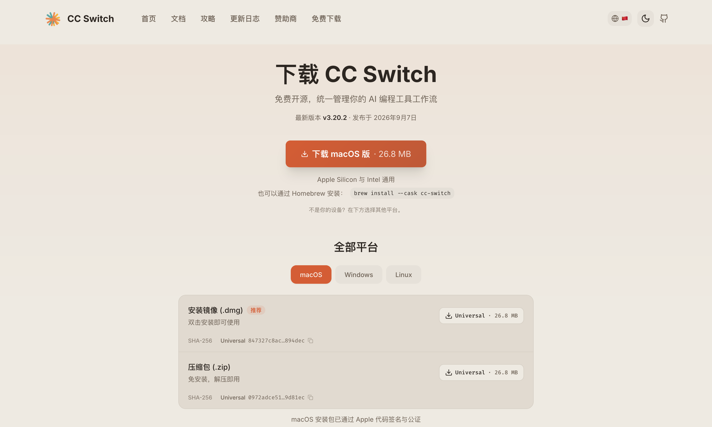
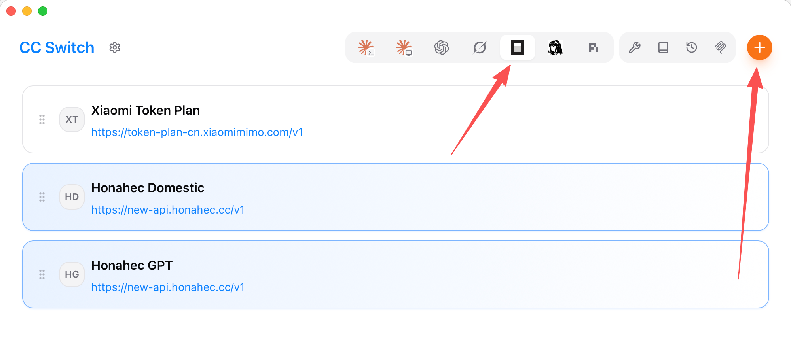
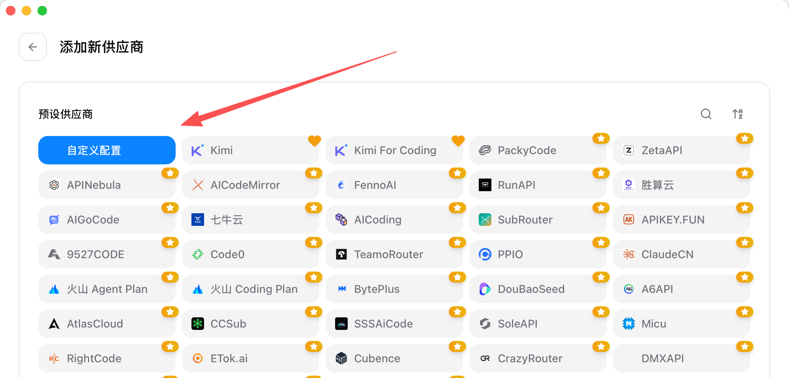
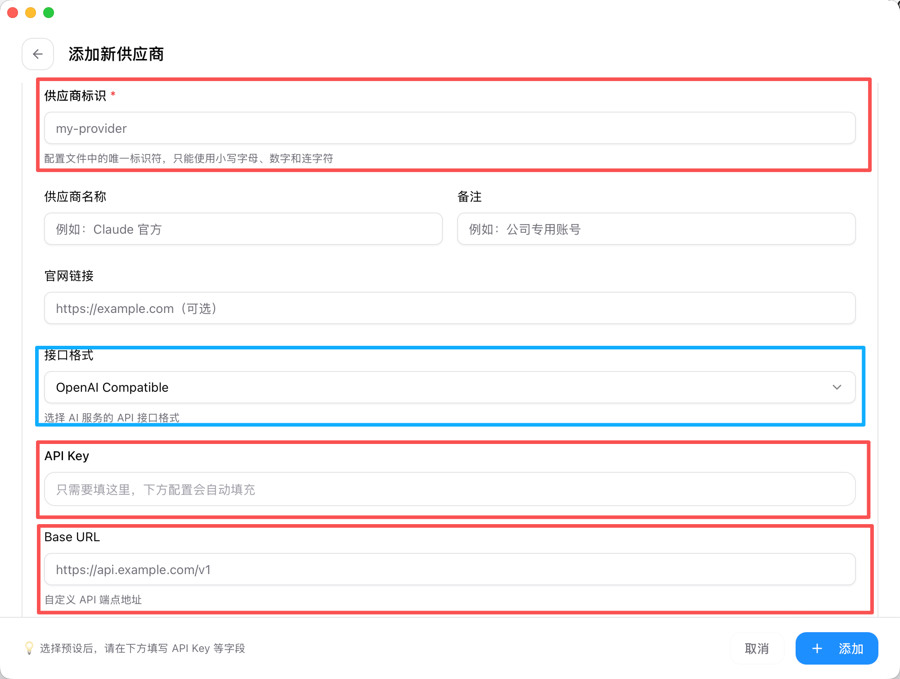
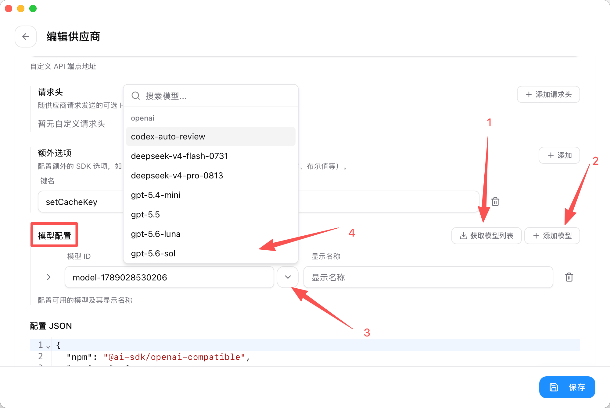
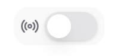

## 简介

来自 CC Switch 自己的介绍：一个“Claude Code、Claude Desktop、Codex、Gemini CLI、Grok Build、OpenCode、OpenClaw 和 Hermes Agent 的全方位管理工具”。

CC Switch 可以帮助你跳过复杂的编辑配置文件的过程，用图形化界面添加和管理模型供应商和模型。对于 Claude Code、Codex 等支持的 API 格式有限的工具，CC Switch 还可以让你在这些软件中使用原本不支持的 API 接口。

搜索引擎中有很多冒充 CC Switch 官方的网站，真正的官网是：<https://www.ccswitch.io>

## 安装

前往官网下载：[CC Switch 下载 - macOS / Windows / Linux 官方安装包](https://www.ccswitch.io/zh/download)

通常情况下**你可以直接点击页面中出现的红色下载按钮**。如果要手动选择，Mac 选择 `.dmg` 文件，Windows 选择 x64 版本的 `.msi` 文件。

## 配置模型 Provider

对于不同的 Coding 工具，CC Switch 配置模型 Provider 的方式略有不同。此处先==以 OpenCode 为例==，其他工具的配置方式请参考 CC Switch 官方文档。

打开 CC Switch 后，在右上角的软件选择栏中选中要配置的 Coding 工具（例如 OpenCode），然后点击右上角的加号按钮。

打开编辑页面后，“预设供应商”会默认选择“自定义配置”。

这里不需要做修改，请直接向下找到配置部分。

在这张图中，==红色框的内容是必填的==：

- “供应商标识”可以随便填写，仅用于显示出来让你区分你的多个供应商。
- “API Key”是你从供应商处获取的 API Key，通常以 `sk-` 开头。
- “Base URL”是你从供应商处获取的 API 地址，通常以 `https://` 开头、`/v1` 结尾。对于绝大多数中转站，这一项的值应为 `https://中转站官网网址/v1`。
- 蓝色框选中的“接口格式”在**极少数情况下**需要自定义，如有需要请咨询你的 API 来源。

而后，==你需要添加你要使用的模型==。

依次按照上图的顺序操作，选择自己需要启用的模型。第 2 到 4 步可以重复多次，直到你成功添加了所有你需要的模型。

最后，==请务必点击右下角的“保存”按钮==。

当你配置完成后，请==重启 OpenCode（或你配置的其它 Coding 工具）来让配置生效==：

- 如果你使用命令行使用 Coding 工具，在命令行中退出相关工具，然后重新执行命令打开软件即可。如果你不会，也可以直接重启终端。
- 如果你使用 Desktop 版本的 Coding 工具，请确保软件被完全关闭。这意味着你在 Mac 上需要按 `Command + Q` 或右键 Dock 中的图标选择退出。

## 其它 Coding 工具与 OpenCode 的区别

### 可启用的供应商数量

OpenCode 支持你同时启用多个供应商的模型，并在 OpenCode 客户端中便捷地切换；而其他 Coding 工具，例如 Codex、Claude Code 等，都只允许你同时启用一个供应商的模型。

对于后者这样的软件，就需要你每次在 OpenCode 中切换供应商后，再重启 Coding 工具，才能使用不同的供应商模型。

### 本地路由

以 Codex 为例：Codex 仅支持调用 OpenAI Response 格式的 API 接口，有时你使用的模型服务商可能不支持这样的格式。此时，CC Switch 可以在本地启动一个路由服务，将你使用的模型服务商的 API 接口转换为 Codex 支持的接口格式，从而让 Codex 可以正常工作。

当你切换到需要本地路由的软件时，左上角出现的这个按钮就是路由开关。

