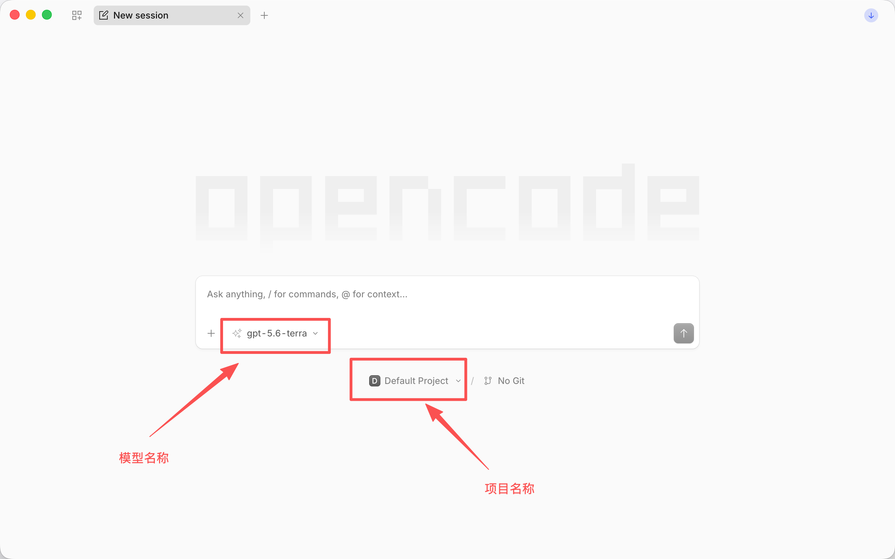

OpenCode 是一个开源的 Coding 工具。

OpenCode 自己也提供了订阅 OpenCode Go，订阅价格为 $10 一个月，支持支付宝支付。这个订阅用量给的比较多，但是只支持一小部分低成本模型。

## 安装

- 官网下载页面：<https://opencode.ai/download>
- Desktop 版本：
  - Mac：<https://opencode.ai/download/stable/darwin-aarch64-dmg>
  - Windows：<https://opencode.ai/download/stable/windows-x64-nsis>
- 在命令行中安装：`curl -fsSL https://opencode.ai/install | bash`

## 配置模型 Provider

详见 [CC Switch](./cc-switch.md)。

## 打开项目目录

如果你使用命令行版本，直接 `cd` 到对应的项目目录，然后执行 `opencode` 命令打开软件即可。

对于 Desktop 版本，打开后应该能看到下面的页面：

点击最下面一行左边的项目名称（截图中为“Default Project”），然后选择自己的项目或者 Add Project 即可。

## 切换模型

在消息输入框中输入 `/model` 后回车可以切换模型。

在 Desktop 版本中，点击模型名称也可以切换模型。
