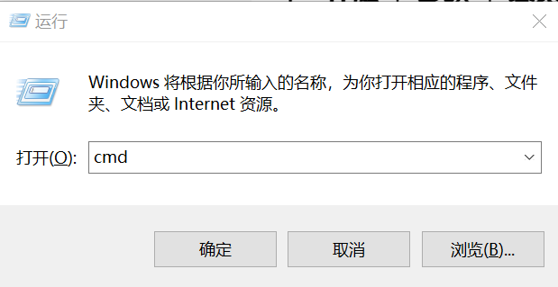
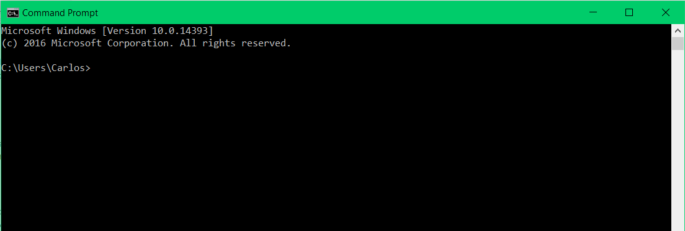
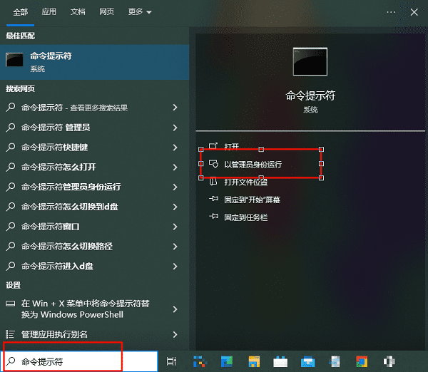
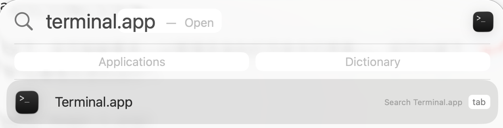
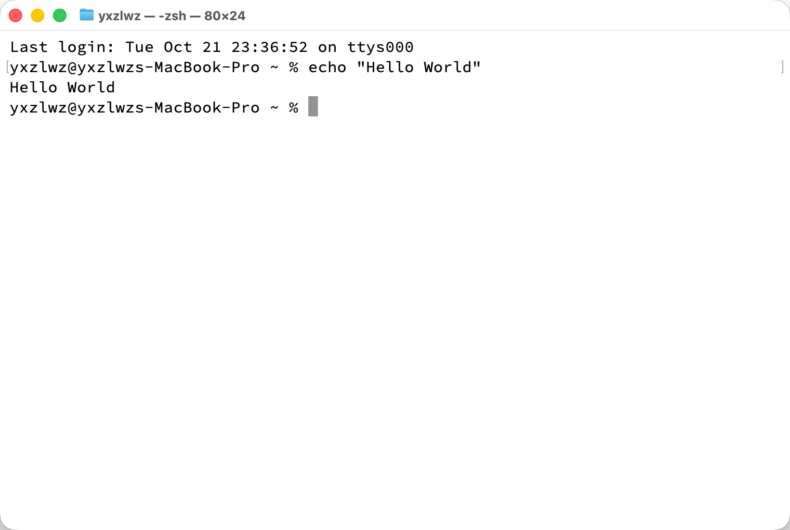

:::: tabs

@tab Windows

Windows 系统中主要有两种命令行工具：`cmd` 和 `PowerShell`。我们将教学的是历史更悠久的 `cmd`。

你可以通过按下 `Win + R` 键打开“运行”窗口，然后输入 `cmd` 并按下回车键来打开命令行界面。

::: note
`Win` 按键指的是键盘上带有 Windows 徽标的按键，通常位于左下角 `Ctrl` 和 `Alt` 之间。
:::

你应当会看到这样的页面：

在某些情况下，你可能被要求==以管理员身份打开命令行界面==。你可以按下 `Win + S` 搜索 `cmd`，然后右键点击“命令提示符”，选择“以管理员身份运行”。

@tab MacOS

在 MacOS 系统中，命令行工具被称为 Terminal（终端）。你可以通过启动台（Launchpad）或 Spotlight（按下 `Command + 空格` 键）搜索 Terminal 并打开它。

理想状态下，你应该看到如下界面：

::::
