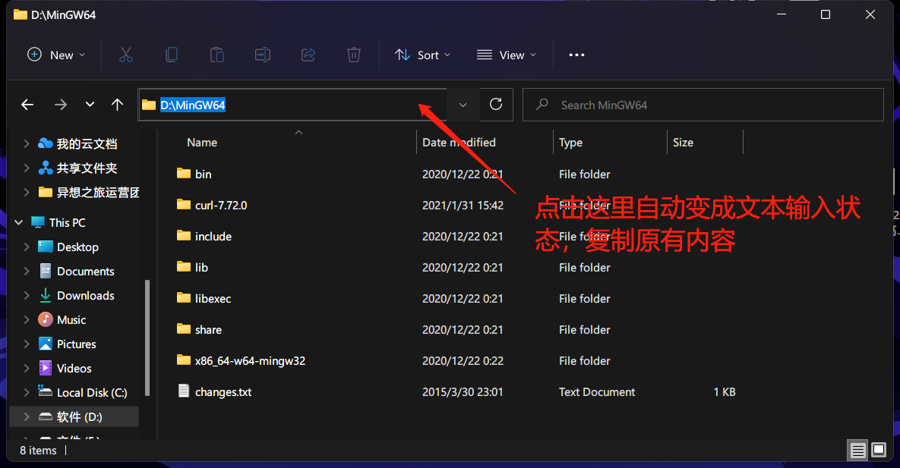
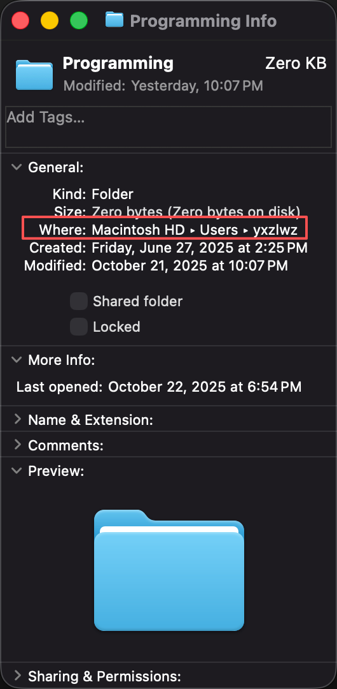
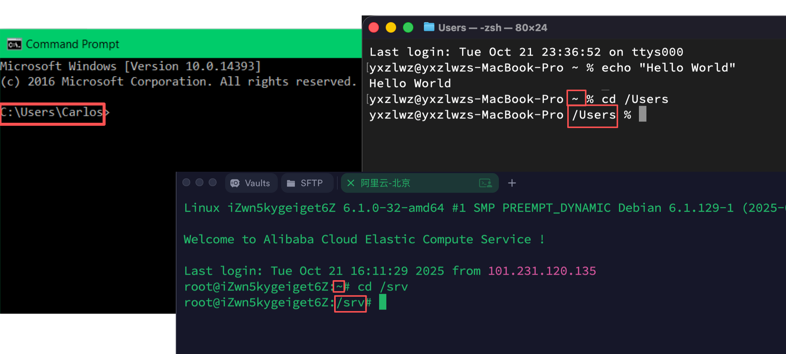
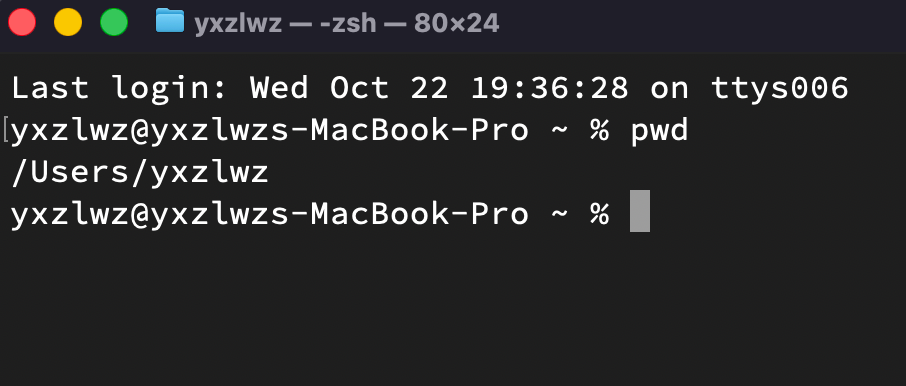
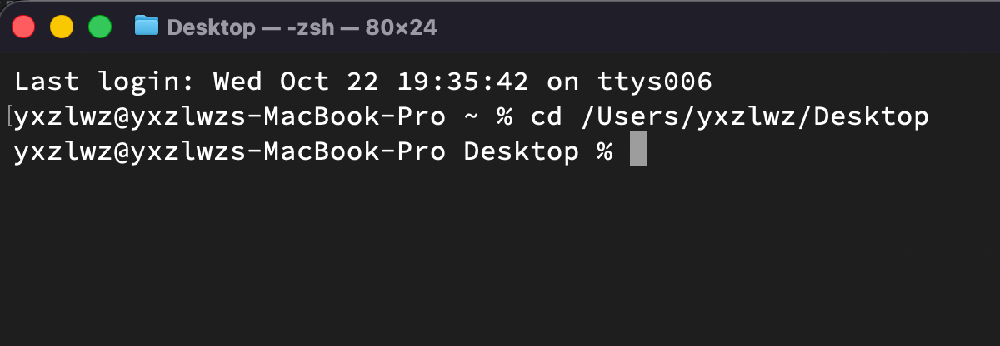
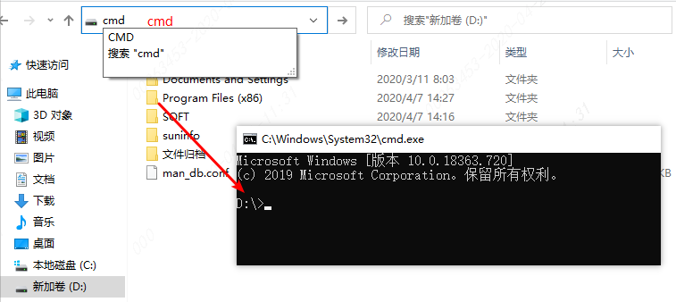

## 什么是目录？

目录（Directory），也称为文件夹（Folder），是计算机中用于组织和存储文件的结构。它们帮助用户和系统更好地管理大量的文件，使得查找和访问变得更加方便。

## 目录的格式是怎样的？

:::: tabs

@tab Windows

在 Windows 系统中，目录路径以盘符（如 `C:`）开头，通常使用反斜杠 `\` 作为分隔符。

例如：`C:\Users\yxzlwz\Desktop`

@tab MacOS 和 Linux

在 MacOS 和 Linux 系统中，目录路径以根目录 `/` 开头，使用正斜杠 `/` 作为分隔符。

例如：

- `/Users/yxzlwz/Desktop`
- `/home/yxzlwz/Desktop`

::: note
这样以盘符或斜杠开头的路径称为“绝对路径”（Absolute Path），表示从文件系统的根目录开始的完整路径。
:::

::::

## 如何找到文件的目录？

:::: tabs

@tab Windows

你可以直接点击资源管理器上方的地址栏，复制当前文件夹的路径：

@tab MacOS

选中任意文件或文件夹，右键点击并选择“显示简介”（Get Info）或按下 `Command + I` 快捷键。

在弹出的信息窗口中，你可以看到“位置”（Where）一栏，显示了该文件或文件夹的完整目录路径。

默认情况下，路径使用三角形作为默认显示的分隔符。但你可以右键点击路径栏，选择“复制为路径名”（Copy as Pathname）来获取标准的目录格式。如上图中的路径复制后会得到 `/Users/yxzlwz`。

请注意，这一路径表示的是文件所在的目录，而不是文件本身的完整路径。

::::

## 命令行中的目录

所有的命令行操作都是在特定目录中进行的。

下图展示了在 Windows、 MacOS 和 Debian 系统的命令行界面中如何查看当前目录位置：

某些情况下，MacOS 不会显示完整路径，而是只显示当前所在的文件夹的名字。此时你可以使用 `pwd`（print working directory）命令来查看完整路径：

默认情况下，命令行会在==当前用户的主目录==下打开：

- Windows 中，主目录通常是 `C:\Users\你的用户名`
- MacOS 中，主目录通常是 `/Users/你的用户名`
- Linux 中，主目录通常是 `/home/你的用户名`

如果你不知道你的用户名，可以通过命令行输入以下命令来查看：

- Windows: `echo %USERNAME%`
- MacOS 和 Linux: `whoami`

特别地，MacOS 和 Linux 系统中，`~` 符号是当前用户的主目录的缩写。例如，如果你的用户名是 `yxzlwz`，那么 `~` 在 MacOS 中代表 `/Users/yxzlwz`。

## cd 命令

我们常常需要切换命令行的当前目录，`cd`（change directory）命令可以帮助我们实现这一点。

在切换之前，最重要的一步，是==你要清楚自己的目标目录是什么==。请通过[上面介绍的方法](#如何找到文件的目录)找到目标目录的标准表示。

然后，在命令行中输入 `cd`，后面跟上一个空格，再粘贴或输入目标目录路径，最后按下回车键即可切换到目标目录。

特别地，对于 Windows 系统：

- 如果你想切换的路径在不同的盘符，你需要先输入目标盘符字母加冒号（例如 `D:`），回车，然后再使用 `cd` 命令切换目录。
- 如果你希望 cmd 的工作目录设置为你目前已经打开的文件夹，你可以直接单击资源管理器上方的目录，然后删除原本的所有内容后，输入 `cmd` 并按下回车键即可。

    

## 相对目录

此处以 MacOS 系统为例，假设我们拥有下面这样的文件结构：

::: file-tree
- Users
  - **yxzlwz**
    - Desktop/
    - Python
      - hello.py
  - otheruser/
:::

假设我们以 `yxzlwz` 的身份打开命令行，默认打开用户的主目录 `/Users/yxzlwz`。

此时，如果我们想要进入主目录下的 `Desktop` 目录，我们可以使用命令 `cd Desktop`。`Desktop` 不是以盘符或斜杠开头的绝对路径，而是表示目标目录相对于当前目录的位置，这种路径称为“相对路径”（Relative Path）。如本例中，系统便会在 `/Users/yxzlwz` 目录下寻找 `Desktop` 目录。

如果我们想要进入 `otheruser` 文件夹，也可以使用相对路径。由于 `otheruser` 目录和当前目录 `yxzlwz` 处于同一级别，我们可以使用命令 `cd ../` 进入上一级目录 `/Users`，然后再使用命令 `cd otheruser` 进入目标目录。在相对路径的表示中，`..` 表示上一级目录。

相对路径还可以结合使用。例如，我们可以使用命令 `cd ../otheruser` 直接从 `/Users/yxzlwz` 切换到 `/Users/otheruser` 。

特别地，你在后面的学习中可能会见到 `./` 。这不代表上一级目录，而是代表当前目录。
