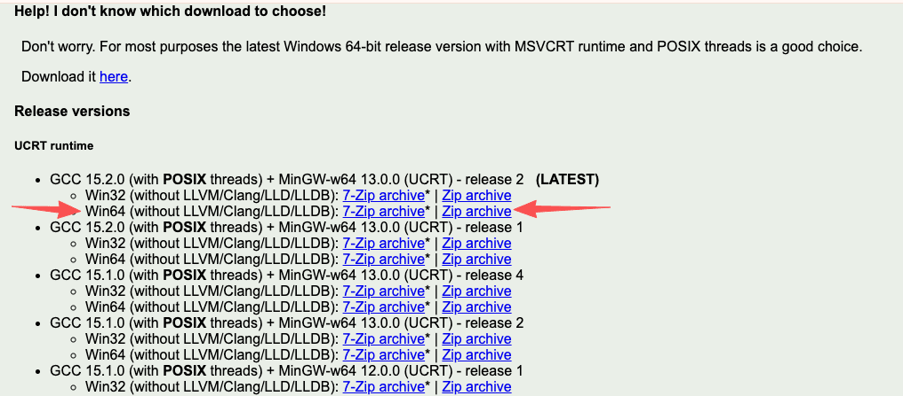
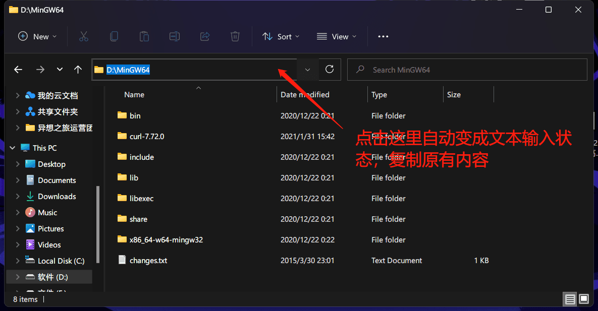
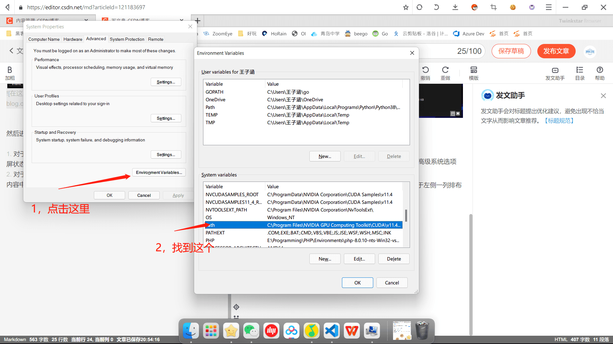
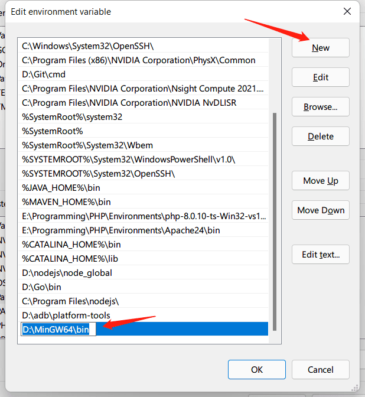

## 测试

如果你安装过一些 C++ IDE，或者使用 MacOS 系统，你的电脑很可能已经安装好了 g++ 编译器。

请先打开命令行工具，输入 `g++`，来检查是否已经安装 g++ 编译器。如果你看到以 `... error: no input files` 结尾的提示，说明你已经安装好了 g++ 编译器，可以跳过这部分内容。

==下面介绍的是 Windows 的安装方法==。

## 下载和解压

你可以通过[此链接](https://winlibs.com/#download-release)下载压缩包。如果没有特殊情况，请选择 ==Win64== 和 ==Zip archive== 版本。

如果上述链接无法打开或下载缓慢，你也可以使用我们提供的备用链接进行下载（更新时间：2025.10.23）:

- [备用链接1](https://cloud.yixiangzhilv.com/s/QvMUN)
- [备用链接2](https://cloud.yxzl.dev/s/QvMUN)

下载完成后，解压缩该压缩包到你喜欢的位置，例如 `D:\MinGW64`。请按下图所示的方法复制当前路径：

## 配置环境变量

然后进行Path设置：

- 对于部分 Windows 10 及更高版本：依次打开设置，系统，关于，高级系统选项（全屏状态下处于右上角）
- 对于更低版本：右键此电脑，属性，高级系统设置（处于左侧一列排布的内容中）

紧接着打开环境变量配置窗口，并在系统变量中选择Path

双击打开 Path，添加一条，内容为你刚刚复制的路径 + `\bin`，例如 `D:\MinGW64\bin`：

此时，请你重启电脑（为防止不必要的麻烦，非必需操作），然后重复[开头的操作](#测试)检测 g++ 是否安装成功。
