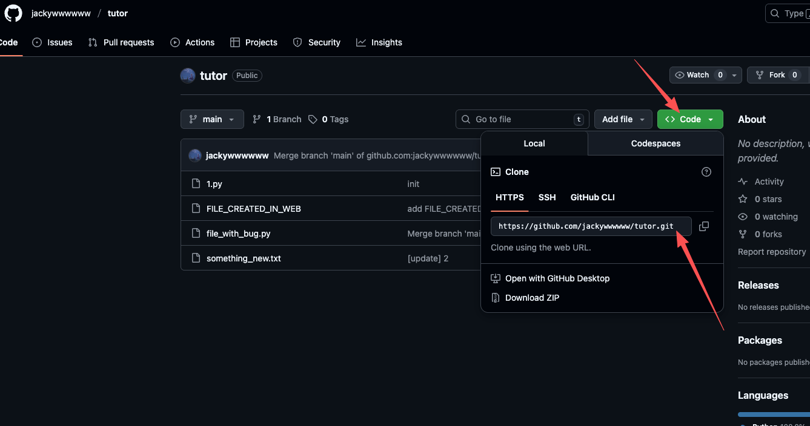
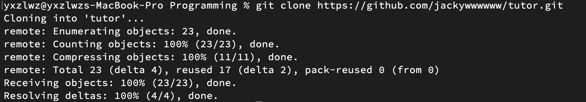

::: details 如果你没有阅读前面的内容，直接打开了这篇文章……
我不能阻止你这么做。

如果你没有阅读前面的 Git 知识，且没有完成 GitHub 的配置，你依然可以通过本文介绍的内容通过==HTTPS 链接==克隆==公开仓库==。前提是你==安装了 Git==。
:::

## 克隆仓库

对于任意一个你有查看权限的 GitHub 仓库（你自己的仓库、公开仓库），我们都可以通过下图所示的方式找到这个仓库的地址。



这里以 `https://github.com/` 或 `git@github.com:` 开头的链接就是 GitHub 仓库的地址。

请注意，对于自己没有完整权限的仓库，你需要使用 HTTPS 链接；而对于自己有权限的仓库，建议使用 SSH 链接。

打开命令行工具，将目录切换到切换到你希望保存代码的位置，输入下方命令并执行，即可将代码克隆到本地。Git 工具在克隆时会自动创建一个新文件夹来存储代码，你无需手动创建。

```bash
git clone 你要克隆的仓库地址
```



看到 `Resolving deltas: 100% (N/N), done.` 的提示后，说明克隆完成了。你可以在当前目录下看到一个新的文件夹，里面就是你克隆的仓库了。

克隆后的仓库不需要你手动进行 `git init`。你只需要 `cd` 进入这个文件夹，就可以查看、编辑仓库的内容，并且像往常一样使用 Git 命令了。

## 继续与远程仓库同步

克隆所得到的仓库默认记录了远程仓库的相关信息，你在推送代码前无需执行上一节介绍的 `git remote add origin` 等命令，在提交更改后直接执行 `git push` 即可。

如果远程仓库有更新，你依然可以通过 `git pull` 命令来获取远程仓库的更新。
