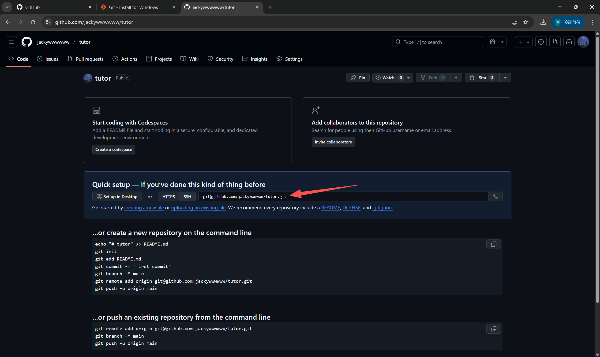

> [!NOTE]
>
> 尽管你可以使用例如 vscode 中极为方便的插件而不是直接输入 Git 命令，但知道 Git 的基础命令及操作方式是必要的。
>
> 通过本文，你将可以学到如何使用 Git 进行基本的版本管理。

## 初始化 Git 仓库

你可以在终端[+terminal]中执行

```bash
git init

```

此命令会在本地创建一个 Git 仓库（你执行命令时所在目录下会生成一个 .git 隐藏文件夹），当然，你不必在意这个文件夹（正如它之所以是隐藏的那样），Git 会为你打理好一切。

此时你的文件目录大致如下：

::: file-tree icon="color"

- your-project
  - ++.git/
  - your-files-like-python.py
  - ...

:::

如果你是在 vscode 中初始化 Git 仓库，左侧资源管理器中的文件应全部变为绿色。

### 细节阐释

为避免产生误解，我将对于 Git 仓库作出部分解释：

1. 本地文件夹 $\neq$ Git 仓库，只有你要求 Git 添加进 Git 仓库的文件才会被添加至本地仓库（下文会讲）；

2. 我们有时称仓库为 ==版本库==，因为 Git 本质上是一个版本管理工具。一般情况下，Git 仓库中会保存所有仓库现有文件以及所有历史更改。

3. 每次提交更改，都将在 Git 仓库中创建一个新的版本、更新文件、记录更新。

==特别说明：本节下面的所有命令，都需要在命令行的工作目录处于 Git 仓库目录中才能执行。==

## 为本地仓库添加文件

你可以通过

```bash
git add your-file-like-python.py
```

来将 `your-file-like-python.py` 文件添加到 Git 文件暂存区[+stage]。

> [!TIP]
>
> 更准确的说，是将 ==文件变动== 添加到暂存区，当仓库中已有但你更新了某个文件也可以使用该命令添加变动。
>
> 甚至，当你删除了某个文件，仍然是使用该命令添加变动（即使该文件已经不在目录中）。

你可以多次使用 git add 命令来将文件添加到暂存区，直到你准备好提交所有更改。

此外，你也可以通过

```bash
git add .
```

来一键添加所有文件。

> [!WARNING]
>
> 有时我们并不需要添加所有文件到 Git 仓库，例如部分缓存文件、编译产物等。

### 让 Git 自动忽略部分文件

创建一个 `.gitignore` 文件如下图：

::: code-tree entry="your-project/.gitignore"

```yaml title="your-project/.gitignore"
node_modules
.cache
*.log
```

```python title="your-project/HelloWorld.py"
print("Hello World!")
```

:::

如果按照上图配置 Git 将会自动忽略所有 node_modules 和 .cache 文件夹及其内部所有文件和所有 .log 文件。

在 .gitigore 中 `*` 为通配符，意为匹配任意，`*.log` 意为不管文件叫什么，只要后缀为 `.log` 就忽略。

思考一下，如果我现在想忽略 migrations 下所有文件，唯独保留 `__init__.py` 怎么办？

提示：在 .gitignore 中， `!` 前缀意为不忽略某个文件。

::: collapse

- 答案

  ```yaml title=".gitignore"
  migrations/*
  !__init__.py
  ```

:::

好了，现在你可以放心地使用 `git add .` 来添加所有文件到暂存区了。

## 提交更改

你可以使用 `git commit` 命令将文件从暂存区提交到 Git 仓库中，并创建一个新的版本[+version]。

```bash
git commit -m "Whatever you want to note."
```

其中，`-m` 后面的引号中的内容是你本次提交的消息（你可以理解为备注），通常用于标记本次修改的主要内容。如果你不加 `-m` 而直接执行 `git commit`，你将被引导使用 vim 来编辑消息，请不要因为看到陌生页面而惊慌。

> [!NOTE]
>
> 更为规范的，我们会统一备注的格式，例如：`feat(theme): add something.` 意为为主题模块新增了xxx功能。
>
> 规范化有助于版本管理与协作。但这是后话了，目前你只需知道如何提交更改即可。

## Git 远程仓库

显而易见的，你需要一种更为优雅的方式与别人协作，而不是互相传文件。

Git 远程仓库便解决了这个问题：它可以简单理解为在云端的 Git 仓库，协作者可以通过访问该仓库完成同步修改、文件、版本等。

我们一般使用 GitHub 作为远程仓库，当然，你也可以使用其它具有远程仓库功能的网站，甚至自建一个远程仓库。

### 更新远程仓库

> [!NOTE]
>
> 在 GitHub 简介章节，我们已经介绍了[如何创建一个 GitHub 仓库](./github-overview.md#创建-github-仓库)

::: steps

1. 首先，你需要连接你的远程仓库：

    ```bash
    git remote add origin 你的仓库地址
    ```

    其中，你的仓库地址为下图中所示

    

2. 向远程仓库推送更改

    首次推送，在命令行中执行

    ```bash
    git push -u origin main
    ```

    推送本地仓库的变动，包括 ==文件、修改记录、版本== 。远程仓库记录内容与本地仓库一致。

    如果不是首次推送，你可以将上述命令简化为

    ```bash
    git push
    ```

:::

### 更新本地仓库

与上文相对应的，更新本地仓库即为

```bash
git pull
```

同样的，这将拉取 ==所有变动== 。

### 解决冲突

机智的你可能就想到了

::: chat title="机智的你"
{:2025-10-21 23:57:40}

{机智的你}
哎？万一有协作者推送了更改，我没有及时更新本地仓库导致与远程仓库冲突了怎么办？

{.}
别担心！Git 作为一个强大的版本管理工具，怎么会没想到这点呢？
你可以使用 merge/rebase 大法！！

:::

Git 为解决本地仓库与远程仓库的冲突，推出了 `merge` 和 `rebase` 命令。

可惜，想要在命令行中理解这些并不容易，也不太必要。

而在 vscode 中使用 merge 是极为容易且直观的，故请前往 [在 VSCode 中使用 Git 的冲突管理部分](./git-with-vscode.md#冲突管理) 查看。

---

恭喜你，你已经学会了 Git 的基本用法！

接下来，你将学习如何使用 GitHub 以及如何在 VSCode 中使用 Git。

[+terminal]:

  在 Windows 中一般使用 cmd 应用；

  在 MacOS 中使用 terminal（终端） 应用；

  或更常用的，我们一般使用 vscode 中的终端。

[+stage]:

  暂存区是一个临时存储区域，它包含了即将被提交到版本库中的文件

[+version]:

  Git 本质上是一个版本管理工具，一般情况下，Git 仓库中会保存所有仓库现有文件以及所有历史更改。