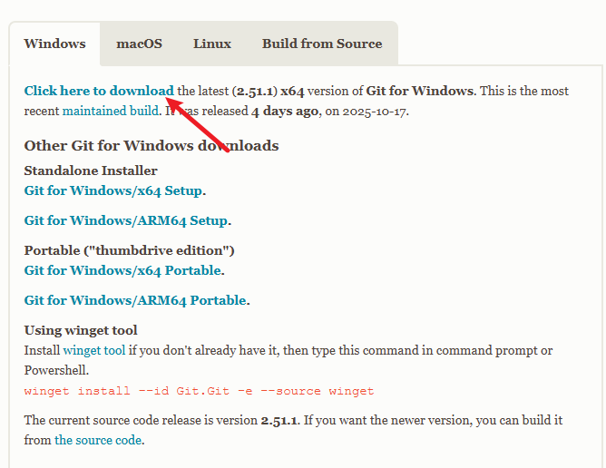
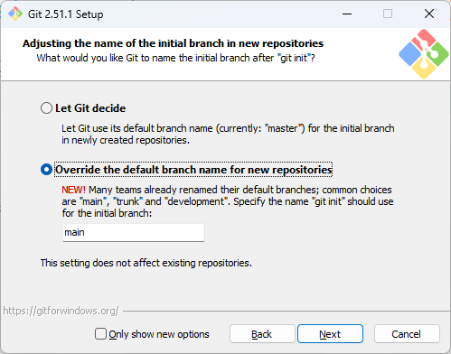

:::: tabs

@tab Windows

你可以通过 [Git 官网](https://git-scm.com/install/windows) 下载最新版的 Git 安装包



打开安装程序后，请在第四页选择选项 ==Override the default branch name for new repositoris== ，并将其设为 ==main== （这是目前更为常用的命名方式），如图



此外，一路 Next 即可。


@tab MacOS

一般来讲， MacOS 自带了 Git，你可以在终端[+terminal]中执行

```bash
git --version

```

如果已有 Git，此命令会输出版本号；

如果没有，理论上，MacOS 会提示你安装 Xcode 命令行工具[+Xcode]，从而自动安装 Git

我不保证这不会出现意外（但应该不会），如果 MacOS 并没有为你自动安装 Git，你可以参考以下步骤手动安装：

  ::: steps

  1. 安装 Homebrew

  > [!INFO]
  >
  > Homebrew 是 MacOS 上主流的的包管理器
  >
  > 包管理器是一个工具，允许用户安装、删除、升级、配置和管理软件包，你可以简单理解为这是一个应用下载器；
  >
  > 现在你不必纠结于此[+note1]，在你学习更深入后 **无法避免** 安装 Homebrew 或其它例如 Nix 的工具。

  ==如果你的电脑现在可以顺利访问外网==，在终端中执行

  ```bash
  /bin/bash -c "$(curl -fsSL https://raw.githubusercontent.com/Homebrew/install/HEAD/install.sh)"
  ```

  这是一个 Homebrew 官方安装脚本，按照脚本指引操作即可。

  ==否则==，你可以使用清华镜像源下载[+tuna]或者自行联系你的朋友获取相关工具。

  若使用镜像源，在终端中依次执行各行命令：

  ```bash
  echo 'export HOMEBREW_BREW_GIT_REMOTE="https://mirrors.tuna.tsinghua.edu.cn/git/homebrew/brew.git"' >> ~/.zshrc
  echo 'export HOMEBREW_CORE_GIT_REMOTE="https://mirrors.tuna.tsinghua.edu.cn/git/homebrew/homebrew-core.git"' >> ~/.zshrc
  echo 'export HOMEBREW_BOTTLE_DOMAIN="https://mirrors.tuna.tsinghua.edu.cn/homebrew-bottles"' >> ~/.zshrc
  echo 'export HOMEBREW_API_DOMAIN="https://mirrors.tuna.tsinghua.edu.cn/homebrew-bottles/api"' >> ~/.zshrc
  source ~/.zshrc

  /bin/bash -c "$(curl -fsSL https://raw.githubusercontent.com/Homebrew/install/HEAD/install.sh)"
  ```

  之后按照脚本指引操作即可。

  2. 使用 Homebrew 安装 Git

  在终端中执行

  ```bash
  brew install git
  ```

  :::

@tab Linux

!!如果你用的是 Linux，你原则上不应当看这个教程!!

执行以下命令即可

```bash
sudo apt update
sudo apt install git
```

::::

## 检验 Git 已成功安装

在终端[+terminal]中执行

```bash
git --version
```

如果输出版本号，则说明安装成功

[+terminal]:

  在 Windows 中一般使用 cmd 应用；

  在 MacOS 中使用 terminal（终端） 应用；

  或更常用的，我们一般使用 vscode 中的终端。

[+Xcode]: 

  你目前不必在意这是什么。

[+note1]: 

  请相信我，Homebrew 是目前最适合你的包管理器。
  
  在你需要接触到例如 Nix 时自然会懂得如何更改它，且你不会后悔使用过 Homebrew。

[+tuna]: 

  清华复制了不少主流软件的镜像到国内的服务器上，方便用户进行快速下载。