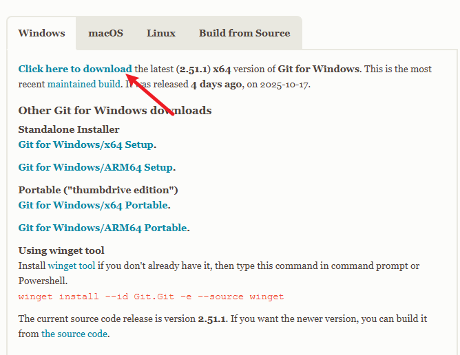

==请选择自己的操作系统对应的安装说明。==

==安装完成后请不要跳过文末介绍的用户信息配置。==

## Windows

你可以通过 [Git 官网](https://git-scm.com/install/windows) 下载最新版的 Git 安装包



打开安装程序后，有非常多的项目可以让你进行自定义。

请你一路点击 Next 即可。


## MacOS

### 检验或使用 Xcode 安装

一般来讲， MacOS 自带了 Git，你可以在终端（即[命令行](/cli/)）中执行

```bash
git --version

```

如果已有 Git，此命令会输出版本号；

如果没有，理论上系统会弹窗提示你安装 Xcode 命令行工具，从而自动安装 Git。

==当且仅当上述步骤均不成功的时候==，你可以参考以下步骤手动安装。

### 使用 Homebrew 安装

请在你的命令行中执行如下命令：

```bash
brew -v
```

如果输出 Homebrew 的版本号，则说明你已经安装了 Homebrew，可以直接跳到下一步；如果没有，请你展开下面的步骤安装 Homebrew。

::: details 安装 Homebrew

==如果你的电脑现在可以顺利访问外网==，在[命令行](/cli/)中执行

```bash
/bin/bash -c "$(curl -fsSL https://raw.githubusercontent.com/Homebrew/install/HEAD/install.sh)"
```

然后按照脚本指引操作即可。

==如果你不能顺利访问外网==，你可以使用清华镜像源下载。在终端中==依次执行各行命令==：

```bash
echo 'export HOMEBREW_BREW_GIT_REMOTE="https://mirrors.tuna.tsinghua.edu.cn/git/homebrew/brew.git"' >> ~/.zshrc
echo 'export HOMEBREW_CORE_GIT_REMOTE="https://mirrors.tuna.tsinghua.edu.cn/git/homebrew/homebrew-core.git"' >> ~/.zshrc
echo 'export HOMEBREW_BOTTLE_DOMAIN="https://mirrors.tuna.tsinghua.edu.cn/homebrew-bottles"' >> ~/.zshrc
echo 'export HOMEBREW_API_DOMAIN="https://mirrors.tuna.tsinghua.edu.cn/homebrew-bottles/api"' >> ~/.zshrc
source ~/.zshrc

/bin/bash -c "$(curl -fsSL https://raw.githubusercontent.com/Homebrew/install/HEAD/install.sh)"
```

之后按照脚本指引操作即可。

:::

安装好 Homebrew 之后，在终端中执行如下命令安装 Git：

```bash
brew install git
```

## Linux

如果你有能力使用 Linux，你不应该需要阅读这部分 Git 教程。

## 检验 Git 已成功安装

在命令行中执行

```bash
git --version
```

如果输出版本号，则说明安装成功。

[+tuna]:

  清华复制了不少主流软件的镜像到国内的服务器上，方便用户进行快速下载。

## 用户信息配置

Git 需要你配置用户名和邮箱，以便在提交时记录作者信息。你可以使用以下命令进行配置。

==请逐行运行以便修改内容。==

用户名建议纯英文、与 GitHub 用户名一致；邮箱建议使用你注册 GitHub 时使用的邮箱。你可以先 [注册 GitHub 账号](/h0r3hpd9/#注册-github-账号) 再回来进行配置。

```bash
git config --global user.name "在此输入用户名"
```

```bash
git config --global user.email "在此输入邮箱"
```

