在绝大多数情况下，我们并不会直接在命令行工具中使用 Git。本节我们将以 VS Code 为例，来演示如何使用图形化界面来进行 Git 管理。

本节内容假定你已经掌握了 VS Code 的基本使用方法。如果没有，请先阅读 xxxx。

## 初始化存储库（init）

使用 VS Code 打开一个文件夹，并按照如图所示打开“源代码管理”菜单。如果你没有在该文件夹中创建过 Git 仓库，你可以通过如图方式操作。

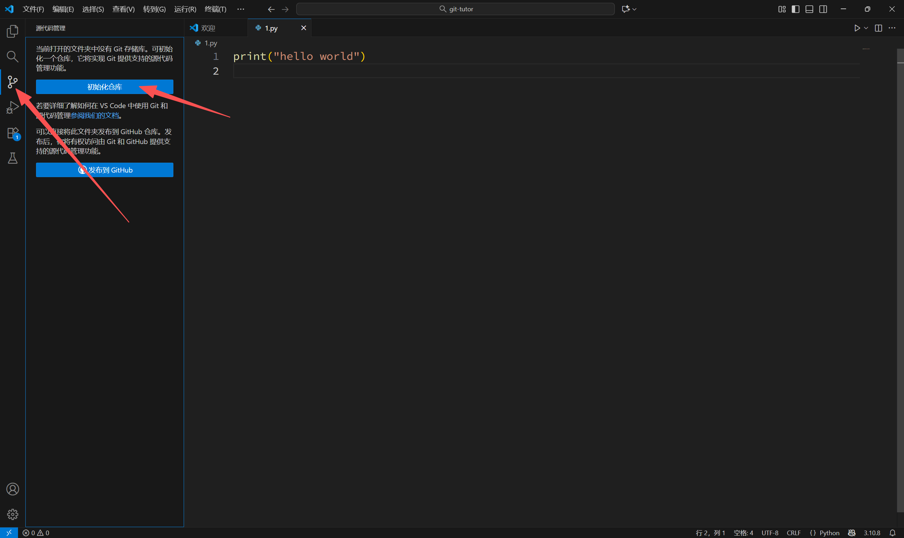

## 暂存和提交

你可以点击如图所示的“+”来暂存（add）所有当前被修改的文件。你也可以点击每个文件后面的“+”（图中未展示）来暂存单个文件。

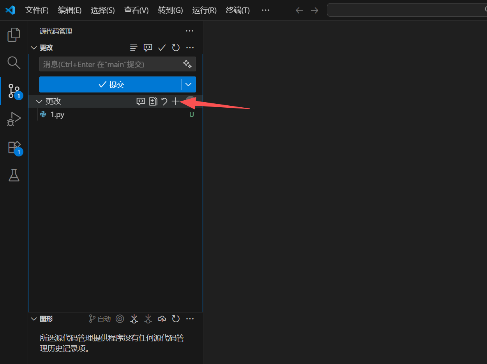

当完成暂存操作后，你可以在文本框中输入提交信息，然后提交（commit）。

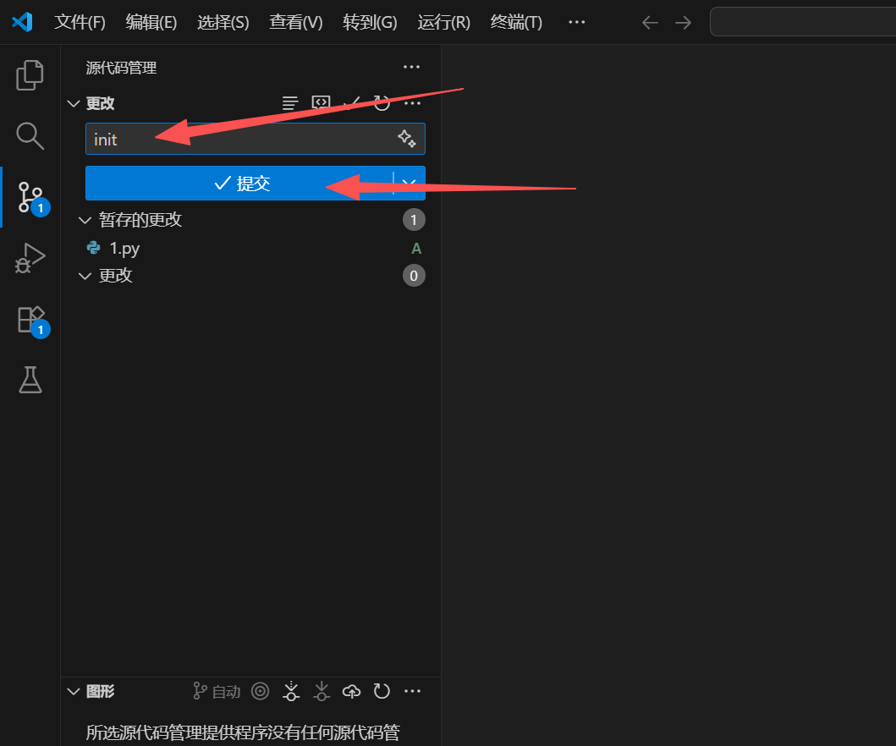

## 撤销提交

点击“更改”右侧的三个点，即可按下图所示找到“撤销上次提交”选项。

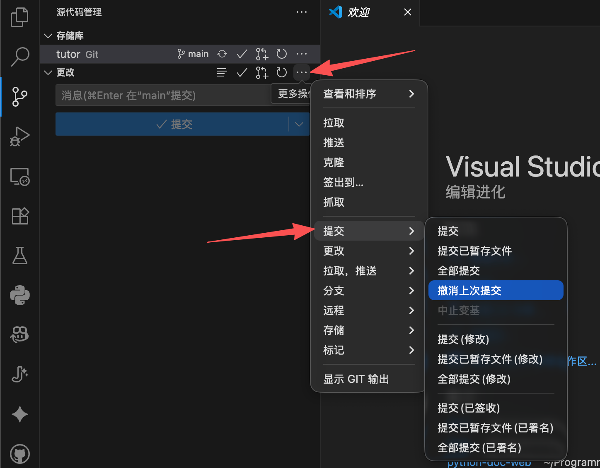

请注意：==你只应该对没有同步到远程的提交执行此操作==。

## 查看某个文件的变更

在源代码管理页面中，点击某个被更改的文件，即可查看本次更改的详细信息。

- “-”或红色表示这一行内容被删除
- “+”或绿色表示这一行内容被添加
- 特别说明的是，Git 的记录精确到行。这意味着当修改一行代码的部分内容时，在 Git 中表现为这一行被删除后重新添加。

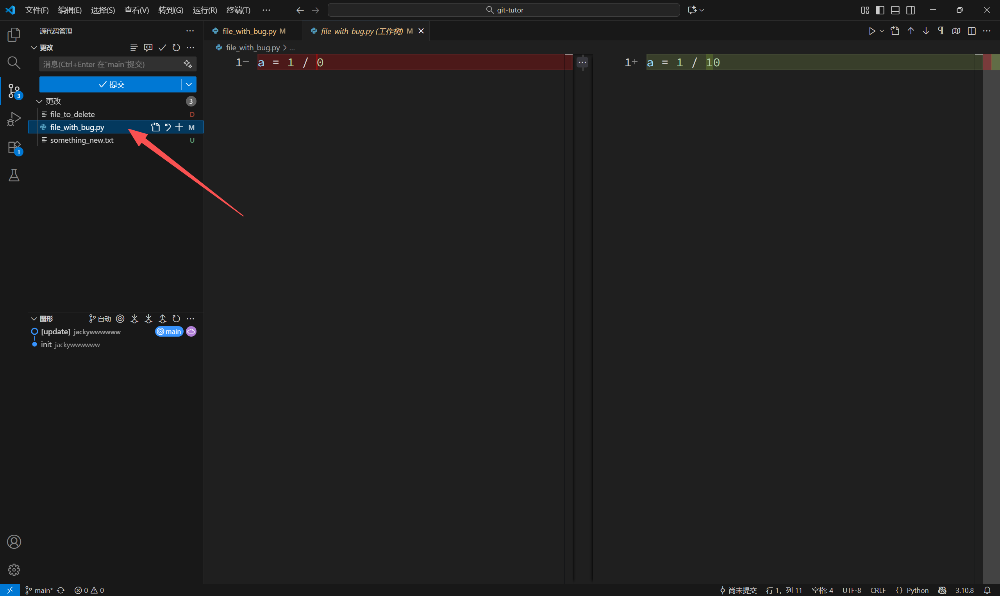

## 查看目录变更情况

你可以在“资源管理器”和“源代码管理”菜单中看到文件（或文件夹）后面带有如下四种标记：

- `U`：表示当前文件没有被 Git 追踪（常见于还没有提交过的新文件）
- `A`：表示创建了新文件
- `M`：表示当前文件被修改（增加或删除部分内容）
- `D`：表示当前文件被删除

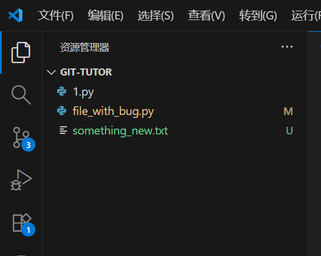

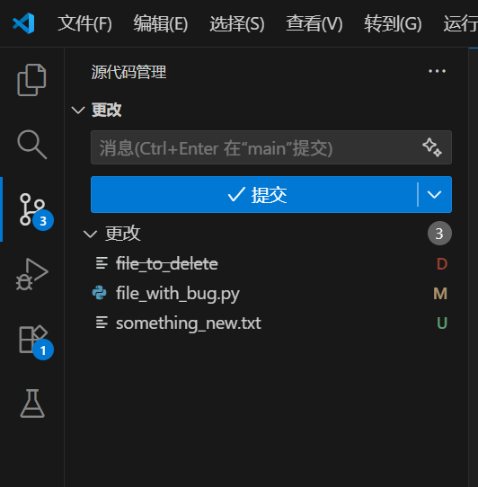

## 远程管理

### 添加远程仓库

如果你还没有为仓库配置远程地址，可以通过如下方式操作：

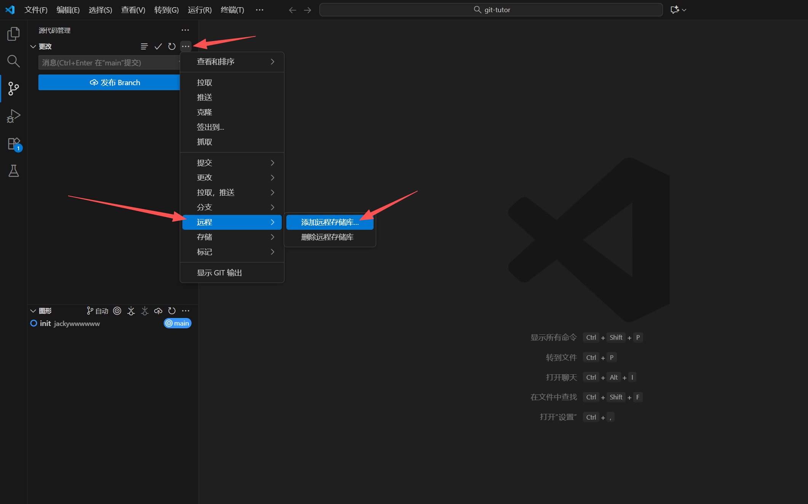

点击后，页面顶部中间会弹出输入框，你需要：

1. 输入你的远程仓库地址（以 `git@` 开头），然后回车
2. 在第二个输入框中，输入 `origin`，然后回车

事实上，通过 VS Code 配置远程仓库并不比直接使用命令行更简单。但是，你可以通过这一图形化界面来查看和管理已有的远程。

### 与已添加的远程仓库同步

在应用的左下角有一个同步按钮，用于与远程仓库进行同步。

如果这是你第一次将本地文件与远程同步，这个按钮会显示为“发布”。

### 冲突管理

对于代码 `a = 1 / 10`，我们同时执行了如下操作：

- 在 GitHub 网页上将其修改为 `a = 1 / 100` 并提交
- 在 VS Code 中将其修改为 `a = 1 / 1000` 并提交

此时再点击同步按钮，我们将看到如下内容：

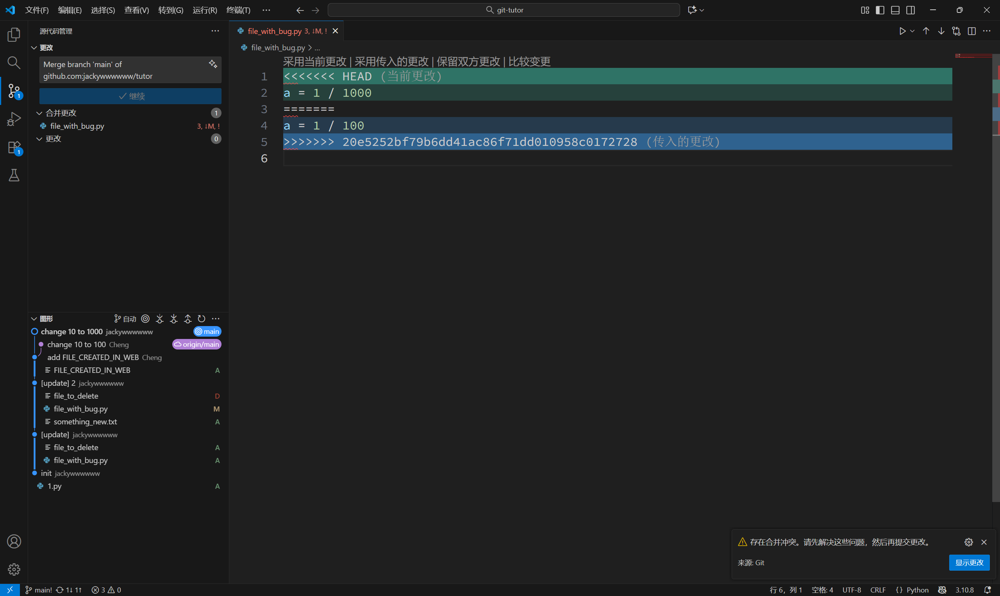

这一现象在多人协作中是很常见的。当两个人同时基于一个历史版本，对同一个文件的同一部分进行修改时，Git 不知道该保留哪一个版本。此时需要我们手动处理冲突。

如上图所示，VS Code 给了我们“采用当前更改”、“采用传入的更改”、“保留双方更改”等选项。我们可以选择其中之一，然后文件会像下图这样“恢复正常”，进而让我们进一步手动修改。

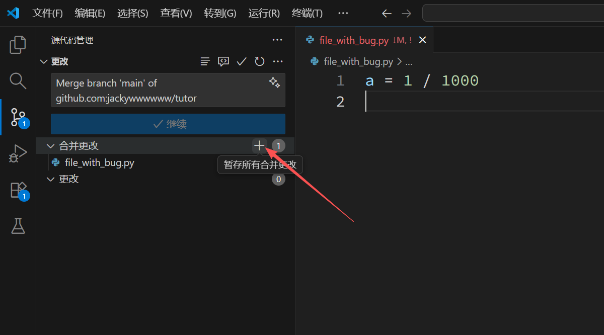

当修改完成后，按上图箭头所示暂存更改、正常提交并再次尝试同步即可。

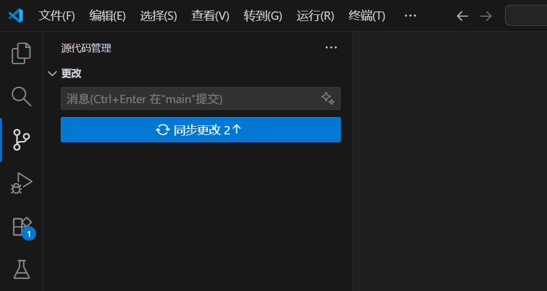

此时你将会看到有两个更改待上传。请不要紧张，这分别是==你原本要同步的提交==和==合并冲突产生的新提交==。
