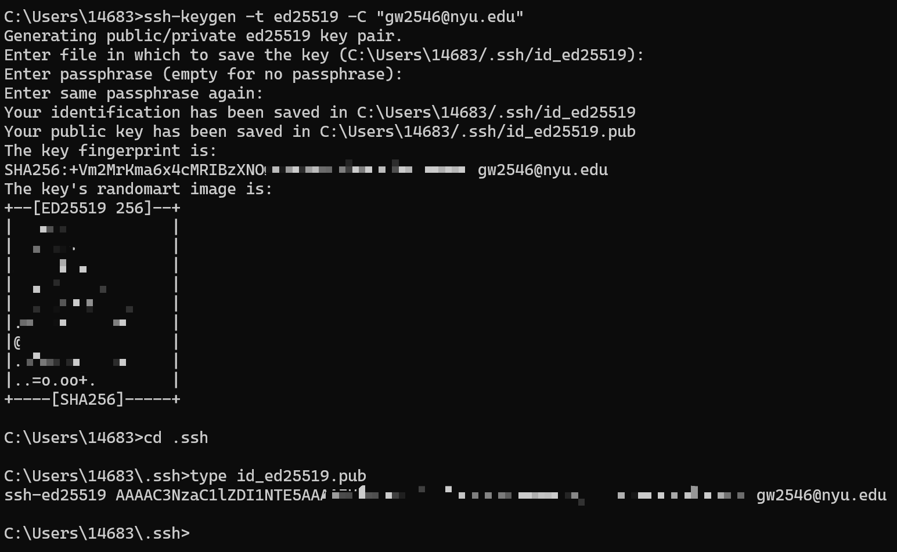
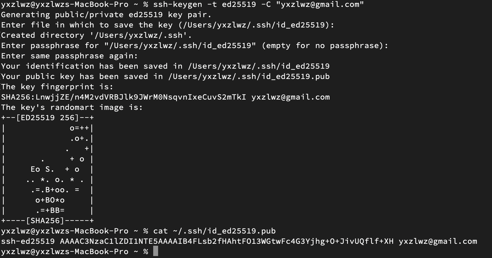

## 确保网络连通性

如果你在尝试本节所介绍的内容时，遇到卡死或与网络有关的报错，请回来阅读这部分内容。

由于中国政府对人民“母亲般的呵护”，你很可能无法正常连接 GitHub。如果你使用浏览器访问 <https://github.com/> 会报错（如“连接已重置”）或速度极慢，请考虑使用魔法工具帮助你的访问。请自行联系你的朋友获取相关工具。

如果你正在使用 Clash 等基于系统代理的魔法工具，考虑执行如下步骤以提高连接成功率。

:::: details 为 SSH 配置 HTTPS 端口


::: tabs
@tab Windows

按下快捷键 `Win + R`，在打开的“运行”窗口中输入 cmd 并点击确定，打开命令行窗口。

在命令行中执行如下命令（粘贴并回车）：

```bash
mkdir "%USERPROFILE%\.ssh" 2>nul
(
echo Host github.com
echo     Hostname ssh.github.com
echo     Port 443
echo     User git
) > "%USERPROFILE%\.ssh\config"
```

@tab MacOS

在启动台或 SpotLight（通过 `command + 空格` 打开）搜索 Terminal 并打开。

在命令行界面中执行如下命令（粘贴并回车）：

```bash
mkdir -p ~/.ssh && echo -e "Host github.com\n    Hostname ssh.github.com\n    Port 443\n    User git" >> ~/.ssh/config
```

:::

关于这一配置的更多信息，参阅 [在 HTTPS 端口使用 SSH - GitHub 文档](https://docs.github.com/zh/authentication/troubleshooting-ssh/using-ssh-over-the-https-port)。

::::

## 注册 GitHub 账号

前往 <https://github.com/signup>，按照提示完成注册流程。

建议使用 Gmail 邮箱注册。==已知使用 163 邮箱可能会出现无法通过人机验证的问题。==

## 配置 SSH Key

==请务必仔细阅读这部分内容。==

==请务必仔细阅读这部分内容。==

==请务必仔细阅读这部分内容。==

配置 SSH Key 是将代码上传到远程服务器的必要步骤。

### 生成 SSH Key

::: tabs
@tab Windows

按下快捷键 `Win + R`，在打开的“运行”窗口中输入 cmd 并点击确定，打开命令行窗口。

在命令行中执行如下命令：请==将提示文本替换为你自己的邮箱==；按下回车后会有若干次提示输入，请==不要输入任何内容==，==不断回车跳过相关输入==。

```bash
ssh-keygen -t ed25519 -C "在此输入你的邮箱"
```

当一个以 ```+----[SHA256]----+``` 结尾的提示出现时，说明 SSH Key 已经生成成功。接下来执行如下命令：

```bash
cd .ssh
type id_ed25519.pub
```

理想情况下，你将得到如下图所示的结果：



@tab MacOS

在启动台或 SpotLight（通过 `Command + 空格` 打开）搜索 Terminal 并打开。

在命令行中执行如下命令：请==将提示文本替换为你自己的邮箱==；按下回车后会有若干次提示输入，请==不要输入任何内容==，==不断回车跳过相关输入==。

```bash
ssh-keygen -t ed25519 -C "在此输入你的邮箱"
```

当一个以 ```+----[SHA256]----+``` 结尾的提示出现时，说明 SSH Key 已经生成成功。接下来执行如下命令：

```bash
cat ~/.ssh/id_ed25519.pub
```

理想情况下，你将得到如下图所示的结果：



@tab Linux

原则上讲，Linux 的操作与 Mac 相同。

**更加原则上讲，如果你已经在使用 Linux，你不应该需要阅读这部分 Git 教程。**

:::

==最后一行的内容就是你的公钥信息。==

### 将公钥上传到 GitHub

在登录账号后，访问 <https://github.com/settings/ssh/new>：

- Title 可随意填写
- Key type 保持默认的选项 Authentication Key
- 将==上一步得到的公钥信息==复制到 Key 中

当完成上述步骤后请点击提交，根据提示完成身份验证即可看到成功提示。


有关更多的同步选项和冲突管理，请见 [VS Code 远程管理](./git-with-vscode.md#远程管理)。

