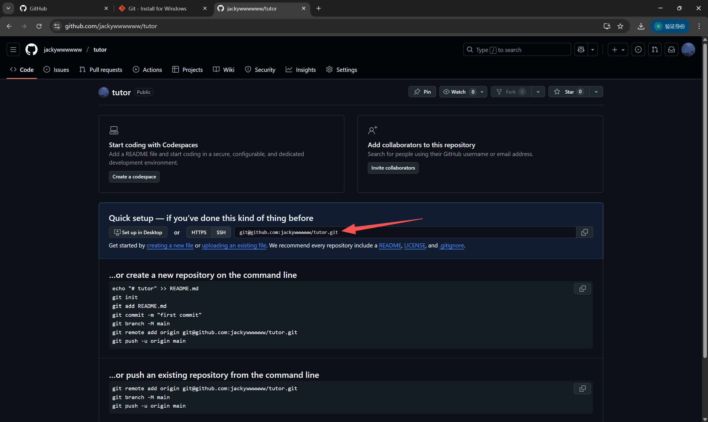

## 前置工作

如果你在尝试本节所介绍的内容时，遇到卡死或与网络有关的报错，请回来阅读这部分内容。

### 确保网络连通性

由于中国政府对人民如母亲般的呵护，你可能无法正常连接 GitHub。如果你访问 <https://github.com/> 会报错（如“连接已重置”）或速度极慢，请考虑使用特殊工具帮助你的访问。请自行联系你的朋友获取相关工具。

### 如果你正在使用 Clash 等工具

考虑执行如下代码以提高连接 GitHub 的成功率。

::: tabs
@tab Windows

按下快捷键 `Win + R`，在打开的“运行”窗口中输入 cmd 并点击确定，打开命令行窗口。

在命令行中执行如下命令（粘贴并回车）：

```bash
mkdir "%USERPROFILE%\.ssh" 2>nul
(
echo Host github.com
echo     Hostname ssh.github.com
echo     Port 443
echo     User git
) > "%USERPROFILE%\.ssh\config"
```

@tab MacOS

在启动台或 SpotLight（通过 `command + 空格` 打开）搜索 Terminal 并打开。

在命令行界面中执行如下命令（粘贴并回车）：

```bash
mkdir -p ~/.ssh && echo -e "Host github.com\n    Hostname ssh.github.com\n    Port 443\n    User git" >> ~/.ssh/config
```

:::

关于这一配置的更多信息，参阅[在 HTTPS 端口使用 SSH - GitHub 文档](https://docs.github.com/zh/authentication/troubleshooting-ssh/using-ssh-over-the-https-port)。

## 配置 SSH Key

配置 SSH Key 是将代码上传到远程服务器的必要步骤。

### 生成 SSH Key

::: tabs
@tab Windows

按下快捷键 `Win + R`，在打开的“运行”窗口中输入 cmd 并点击确定，打开命令行窗口。

在命令行中==依次==执行如下命令（在执行第一行命令时会有若干次提示输入，请==不断回车跳过相关输入==）：

```bash
ssh-keygen -t ed25519 -C "在此输入你的邮箱"
cd .ssh
type id_ed25519.pub
```

理想情况下，你将得到如下图所示的结果：


==最后一行的内容就是你的公钥信息。==

@tab MacOS

在启动台或 SpotLight（通过 `Command + 空格` 打开）搜索 Terminal 并打开。

在命令行界面中，==依次==执行如下命令（在执行第一行命令时会有若干次提示输入，请==不断回车跳过相关输入==）：

```bash
ssh-keygen -t ed25519 -C "在此输入你的邮箱"
cat ~/.ssh/id_ed25519.pub
```

理想情况下，你将得到如下图所示的结果：


==最后一行的内容就是你的公钥信息。==

@tab Linux

原则上讲，Linux 的操作与 Mac 相同。

**更加原则上讲，如果你正在使用 Linux，你不该阅读这部分 Git 教程。**

:::

### 将公钥上传到 GitHub

在登录账号后，访问 <https://github.com/settings/ssh/new>：

- Title 可随意填写
- Key type 保持默认的选项 Authentication Key
- 将==上一步得到的公钥信息==复制到 Key 中

当完成上述步骤后请点击提交，根据提示完成身份验证即可看到成功提示。

## 创建 GitHub 仓库

要将代码存储到 GitHub 上，你需要先创建一个仓库。

你可以访问 <https://github.com/new> 来创建一个新仓库。你可以使用任意字母和数字来命名你的仓库，并设置可见性。

创建好仓库后，你应该会看到这样的页面：



红色箭头所指的即为==你的仓库地址==。

## 将本地仓库推送到 GitHub

> [!NOTE]
>
> 接下来的步骤涉及 Git 命令，请先阅读前置章节 [Git 的基础操作](./git-basics.md)

打开命令行工具并进入你的本地仓库所在目录，执行如下代码：

```bash
git remote add origin 你的仓库地址
git push --set-upstream origin main
```

（如果你的分支名称不是 main，请自行修改）

当推送完成后，你的 GitHub 仓库页面会变成类似下面这样：


有关更多的同步选项和冲突管理，请见 [VS Code 远程管理](./git-with-vscode.md#远程管理)。

## 克隆 GitHub 仓库

对于任意一个公开的 GitHub 仓库，我们都可以通过下图所示的方式找到这个仓库的地址。


请注意，对于自己没有完整权限的仓库，你应当使用 HTTPS 链接（而非 SSH 链接）来克隆。

打开命令行工具，切换到你希望保存代码的路径，输入下方命令并执行，即可将代码克隆到本地。Git 工具在克隆时会自动创建一个新文件夹来存储代码，你无需手动创建。

```bash
git clone 你要克隆的仓库地址
```


