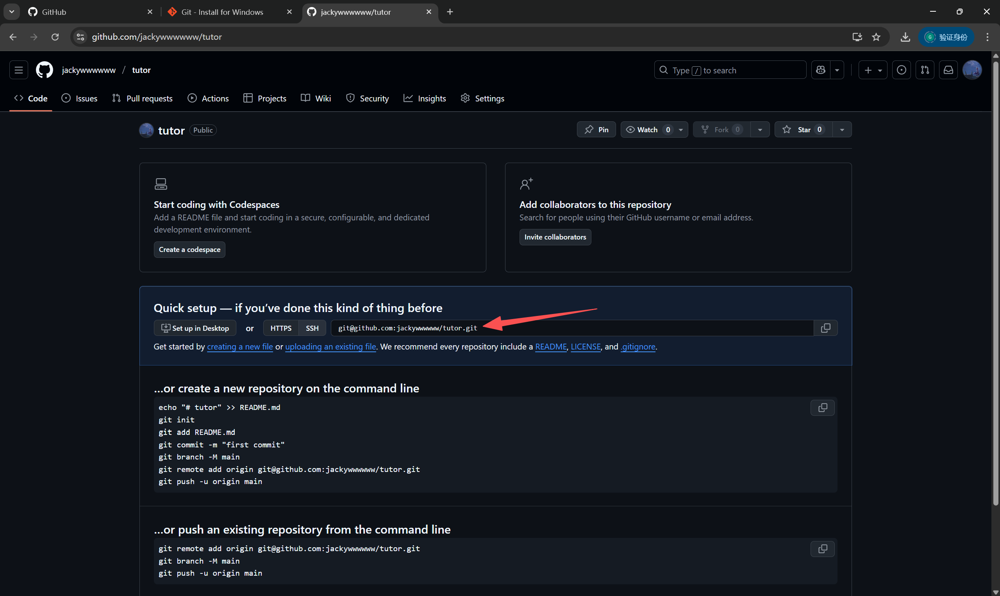
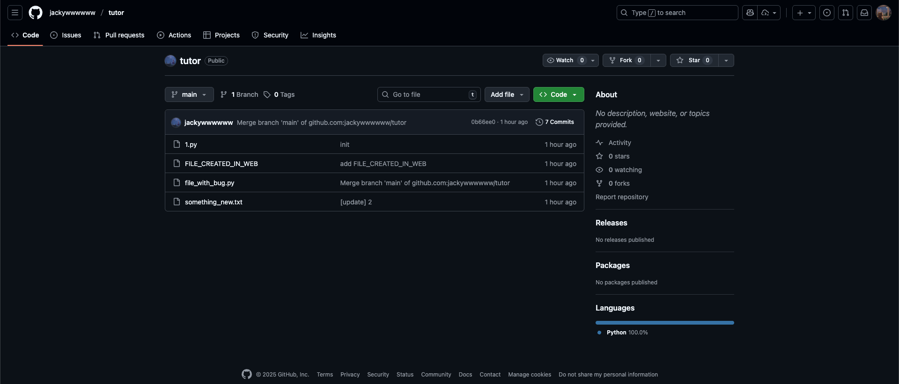

当你准备使用 GitHub 来同步你自己的仓库，或你克隆了别人的仓库并更改后，你可以使用本文介绍的方式把你的更改推送到 GitHub。

只有已经提交的更改才能被推送到 GitHub。如果你不知道暂存、提交等 Git 操作，请先阅读 [Git 基础操作](./git-basics.md)。

## 首次推送

当且仅当你的代码仓库==不来自于克隆的仓库==且==从未被推送到 GitHub 时==，你需要遵循如下内容；否则，请直接阅读 [推送更改](#推送更改)。

### 创建 GitHub 仓库

要将代码存储到 GitHub 上，你需要先创建一个仓库。

你可以访问 <https://github.com/new> 来创建一个新仓库。你可以使用任意字母和数字来命名你的仓库，并设置可见性（公开或私有）。

创建好仓库后，你应该会看到这样的页面：



红色箭头所指的即为==你的仓库地址==。

### 将本地仓库推送到 GitHub

打开命令行工具并进入你==已有的本地仓库（执行过 `git init` 的文件夹）所在目录==，执行如下代码：

```bash
git remote add origin 你的仓库地址
```

```bash
git push --set-upstream origin main
```

当推送完成后，刷新你的 GitHub 仓库页面，你会看到类似下面这样：



## 推送更改

当你完成首次更改后，以后只要本地有新的提交，你都可以通过下面这个简单的命令来推送更改：

```bash
git push
```

## 拉取远程仓库的更改

Git 并不会自动拉取远程仓库的更改。如果别人更改了远程仓库的内容，你需要执行如下命令来拉取这些更改：

```bash
git pull
```

## 解决冲突

机智的你可能就想到了

::: chat title="机智的你"
{:2025-10-21 23:57:40}

{机智的你}
哎？万一有协作者推送了更改，我没有及时更新本地仓库导致与远程仓库冲突了怎么办？

{.}
别担心！Git 作为一个强大的版本管理工具，怎么会没想到这点呢？
你可以使用 merge/rebase 大法！！

:::

Git 为解决本地仓库与远程仓库的冲突，推出了 `merge` 和 `rebase` 命令。

可惜，想要在命令行中理解这些并不容易，也不太必要。

而在 vscode 中使用 merge 是极为容易且直观的，故请前往 [在 VSCode 中使用 Git 的冲突管理部分](./git-with-vscode.md#冲突管理) 查看。