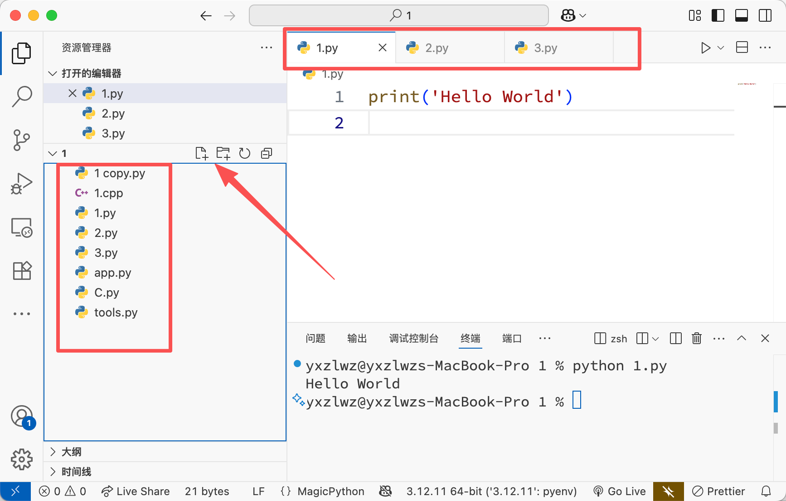

## 打开文件夹

当我们真正在开发项目的时候，往往需要同时管理同一个文件夹下的多个文件（其实你做编程作业的时候也有类似的需求吧）。

与记事本或 Python 内置的编辑器不同，专业的编译器可以帮助我们轻松管理某个文件夹下的所有文件。

在 VS Code 中，我们可以点击“文件”菜单，选择“打开文件夹...”来打开某个文件夹。根据系统菜单的提示打开某个文件夹后，VS Code 会自动将该文件夹下的所有文件显示在左侧的资源管理器中：

此时，借助图中圈出的资源管理器和多标签功能，我们就可以轻松管理多个文件了。

你可以通过箭头所指的按钮来创建新文件或文件夹。创建文件时，请注意添加文件扩展名（如 `.py`、`.txt` 等）

特别提醒：在资源管理界面删除的文件很可能==不会进入回收站==，删除前请三思！
