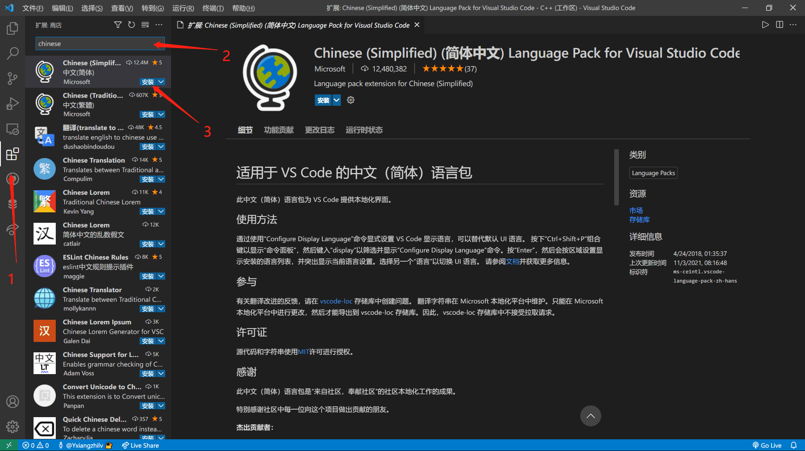
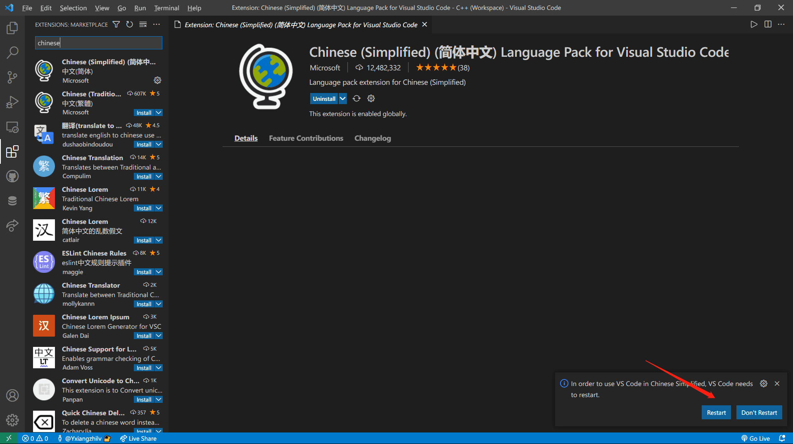
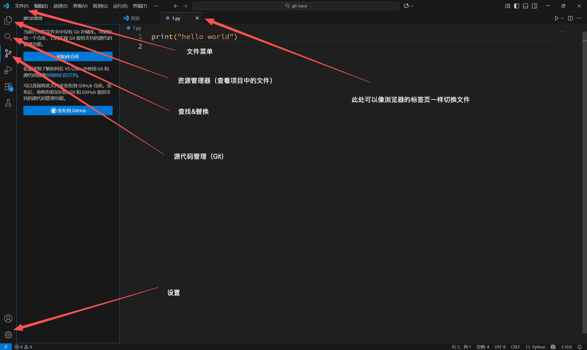
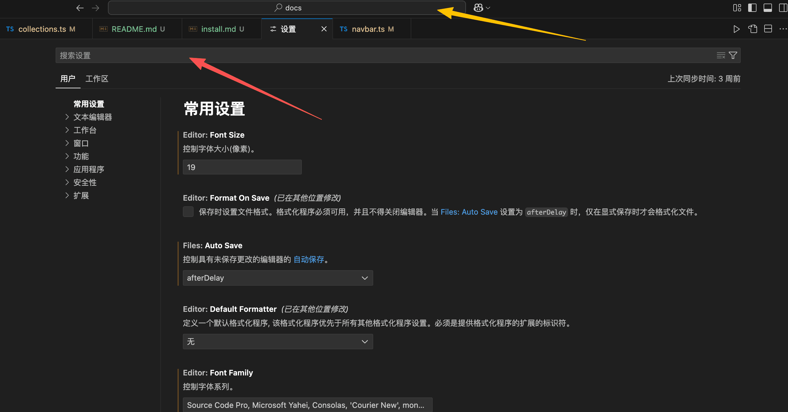
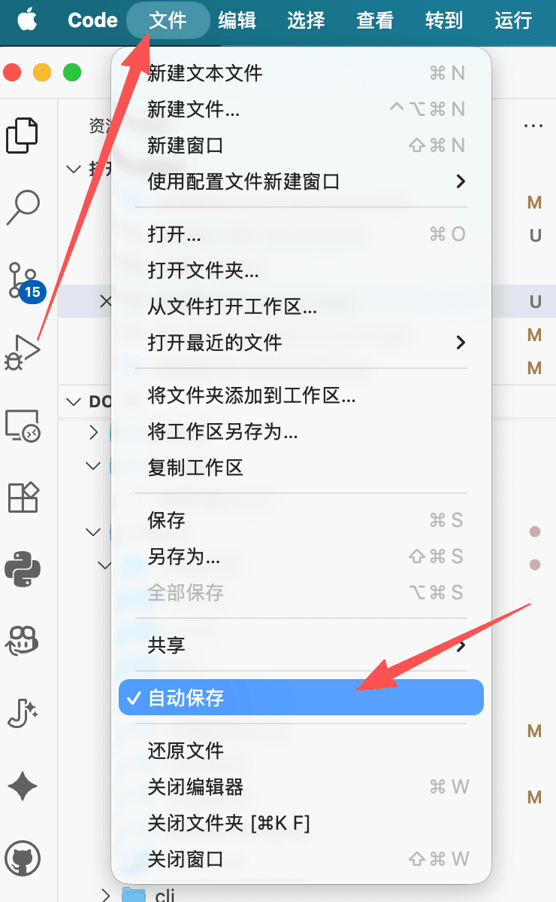
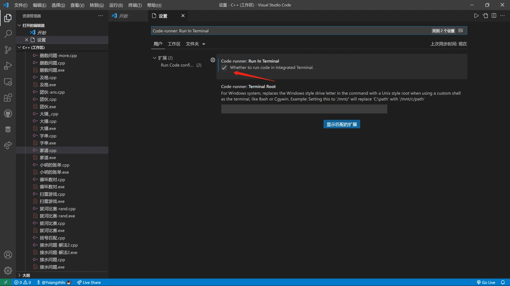

## 安装 VS Code

你可以从VS Code 官方网站下载适用于你操作系统的安装包，并按照提示进行安装：[Visual Studio Code - Code Editing. Redefined](https://code.visualstudio.com/)

## 设置语言

::: note
我知道你的英语很好，但是没必要折磨自己。
:::

1. 打开 VS Code 以后，按下 `Ctrl + Shift + X`（Mac 为 `command + shift + X`）打开插件安装界面
2. 在搜索框中输入 `Chinese`，找到 `Chinese (Simplified) Language Pack for Visual Studio Code`，点击安装：

   

3. 安装完成后，根据页面右下角的提示重启 VS Code

   

## 认识界面

刚安装软件时，右侧可能会默认打开 AI 对话框。点击对话框右上角的关闭按钮即可，你暂时不需要它。

## 设置字体大小

### 打开设置界面

你可以通过左下角的设置按钮或快捷键 `Ctrl + ,`（Mac 为 `command + ,`）进入设置界面。

此时屏幕上出现了两个搜索框。在本节内容中，我们只关注和使用==红色箭头所指的搜索框==。

### 修改文本编辑器字体大小

打开设置界面后排在第一位的 `Editor: Font Size` 即为编辑器字体大小。你可以根据个人喜好进行调整，我比较推荐的数值是 17 - 20。

在设置中进行的修改都是立即生效的，你可以通过“文件”菜单新建一个文本文件，并随意输入一些文本，来观察字体大小的变化。

### 修改命令行字体大小

在搜索框中输入 `terminal.integrated.fontSize`，即可调整命令行的字体大小。推荐数值为编辑器字体大小基础上减去 2 或 3。

如果你现在不知道这一设置的作用，也可以稍后再回来调整。

## 开启自动保存

你可以点击顶部的“文件”菜单，选择“自动保存”来开启自动保存功能。

如果你不希望开启自动保存，请确保在每次运行代码前，你已经手动保存了当前文件（快捷键 `Ctrl + S`，Mac 为 `command + S`）。

## Code Runner 配置

无论你要运行哪种编程语言的代码，在大多数情况下，Code Runner 插件都是非常有必要的。它可以帮助你快速运行多种编程语言。

先打开插件安装界面（与安装简体中文语言的方式相同），然后搜索 `Code Runner`，找到插件后点击安装：

安装完成后，回到设置界面，搜索 `Code-runner: Run In Terminal`，并勾选它：

## 下一步

截止到这里，你完成了 VS Code 的通用配置。

现在，你可以：

- 了解如何配置特定的编程语言
  - [Python](./python.md)
  - C++
- [了解如何使用 VS Code 进行版本控制（Git）](/git/zzeqw9x5/)
