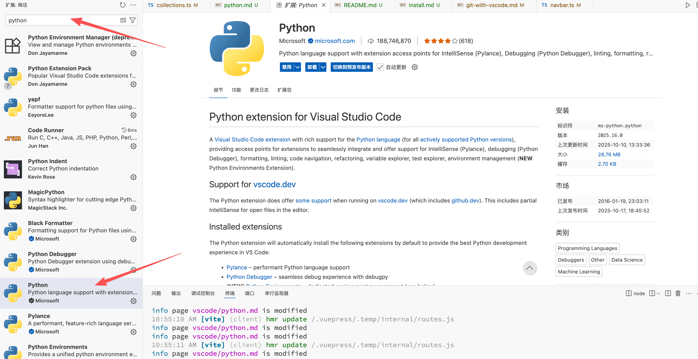
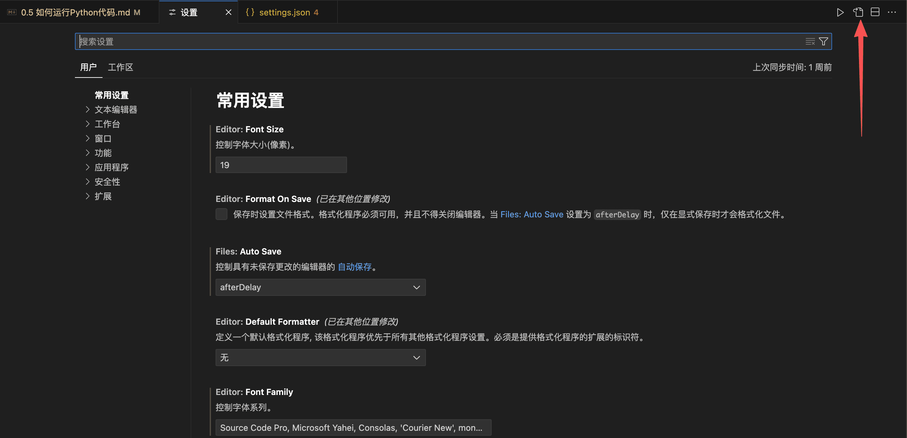
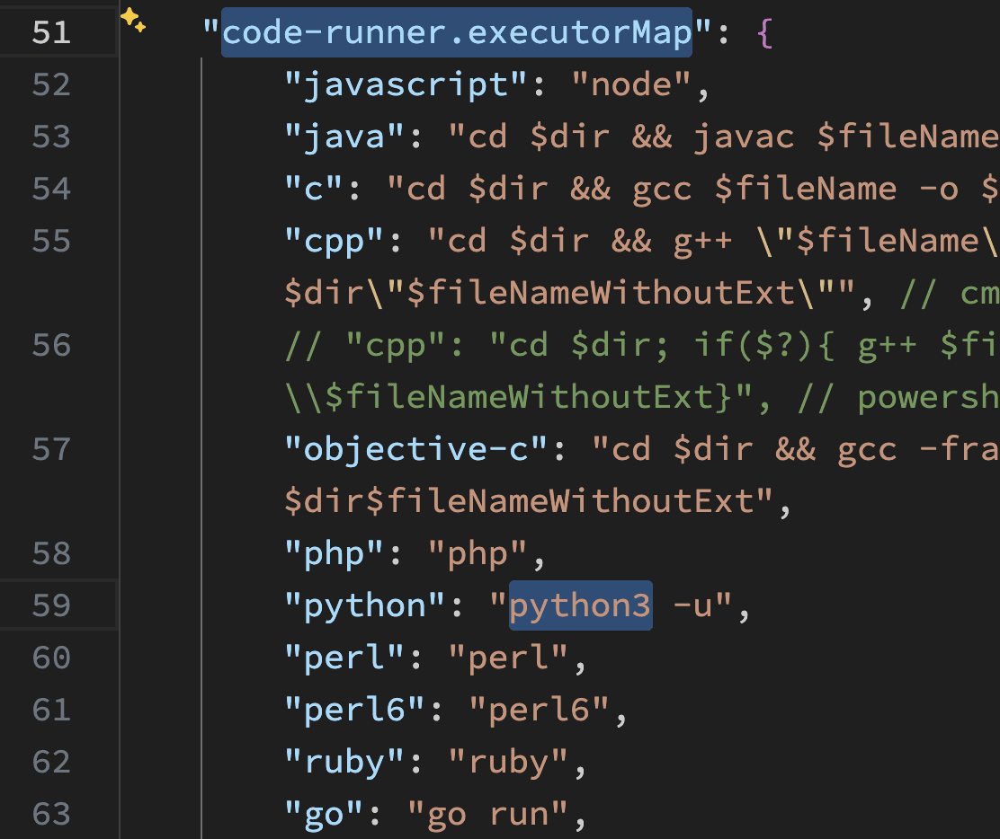
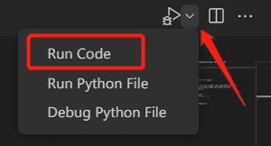
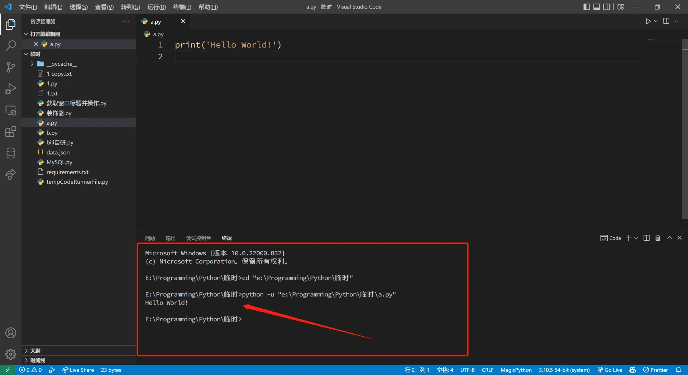
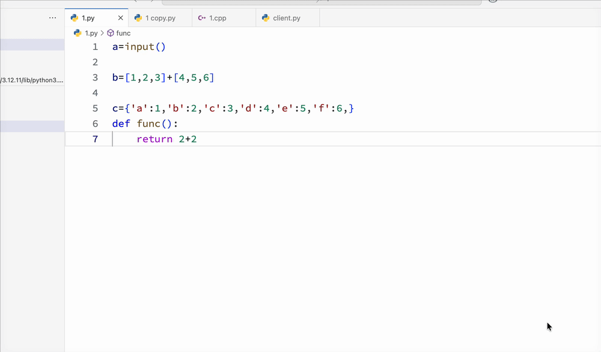

阅读本节内容前，请确保你已经安装了 Python 环境。否则，请阅读[Python 环境安装 | Python 入门文档](https://python.yxzl.dev/jvvxy8eb/)。

## 安装 Python 插件

打开插件安装界面，然后搜索 `Python`，找到由 Microsoft 出品的插件后点击安装：

## Code Runner 特殊设置

==Windows 用户请跳过此设置。==

==Windows 用户请勿进行此设置。==

Code Runner 默认使用 `python` 命令来运行程序。而在 Mac 上，通常需要输入 `python3` 才能正常找到 Python 解释器。因此，我们需要进行特别设置。

在设置界面（打开方式见上文），点击右上角的按钮打开配置文件：

找到 `code-runner.executorMap`（可以通过快捷键 `command + F` 搜索），再在其中找到 `python`，将后面的 `python -u` 更改为 `python3 -u`。

## 运行代码

现在你可以借助 Code Runner 来运行代码了。点击右上角的运行按钮或者按下快捷键 `Ctrl + Alt + N`（Mac为`control + option + N`）。

如果你的运行按钮如下图所示，有一个爬虫的角标，请先点击下拉三角，再选择 Run Code 选项：

==代码文件将在下方的终端运行出来。==

如果你的代码有用到 `input` 函数获取用户输入，请==先用鼠标在图中箭头位置单击以选定焦点位置==，再进行输入。

## 格式化插件

格式化可以使你的代码阅读起来更舒服，这是一个良好的编程习惯，在团队协作中尤为重要。

VS Code 的插件市场中有许多 Python 格式化插件可供选择，本人在使用的是 **yapf**，而目前更流行的格式化插件是 **Black Formatter**。另外，如果你正在协作 Python 项目或管理大型项目，请考虑使用 **Ruff**，这是一个支持使用配置文件来指导、以及命令行工具进行代码风格检查的格式化工具。你可以选择一个你喜欢的进行安装。

安装后，可以在编辑 Python 文件时使用快捷键 `Shift + Alt + F`（Mac 为`shift + option + F`）来使用。

