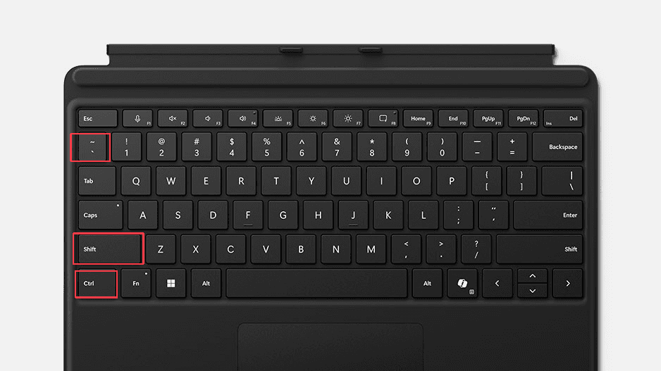
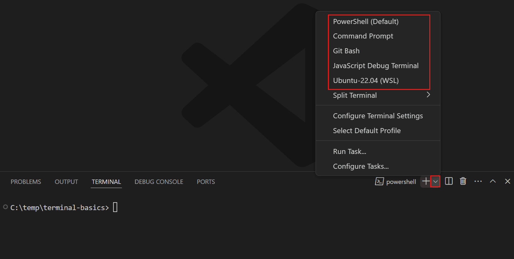
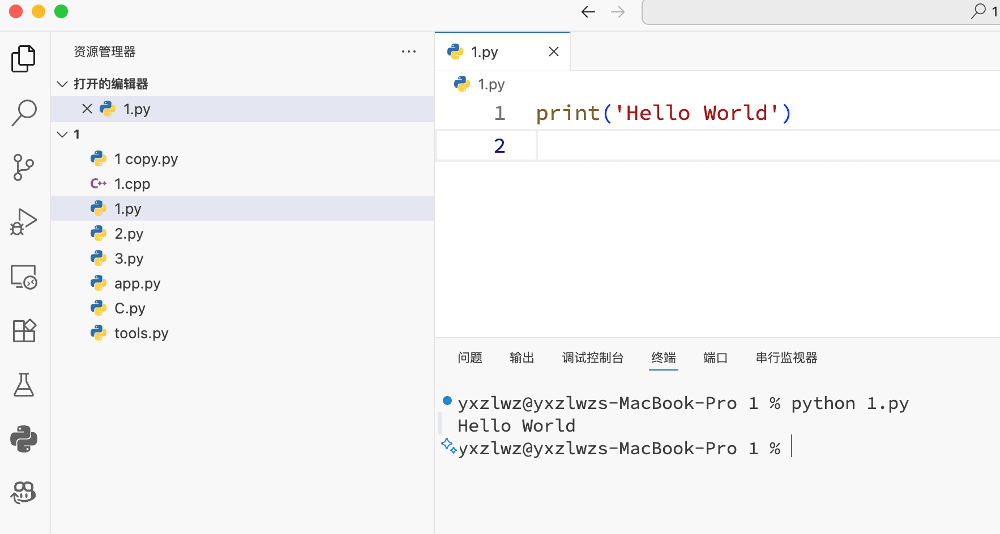

在 VS Code 中，你可以使用内置的终端（Terminal）来访问命令行工具，如 Windows 的 cmd、PowerShell，或 MacOS 和 Linux 的 bash、zsh 等。

## 打开终端

你可以通过以下方式打开终端：
- 顶部菜单栏的“终端”->“新建终端”
- 快捷键 ``` Ctrl + Shift + ` ``` （Mac 为 ``` control + shift + ` ```）

  

## 切换终端类型

对于 Windows 用户，VS Code 默认打开 PowerShell 终端。如果你想使用 cmd 终端，可以点击终端右上角的下拉箭头，然后选择 `Command Prompt`。你也可以通过“选择默认配置文件”（Select Default Profile）设置默认值。



## 工作目录

如果你已经在 VS Code 中[打开了某个文件夹](/vscode/gx5ca361/#打开文件夹)，终端的工作目录会自动设置为该文件夹路径。

因此，你可以直接使用相对路径来运行程序。例如，我想运行当前文件夹下的 `1.py`：


